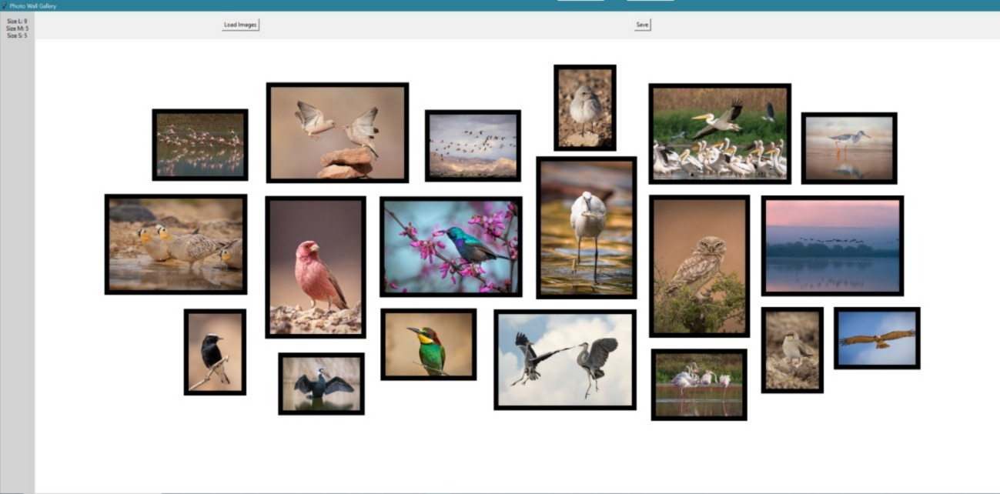
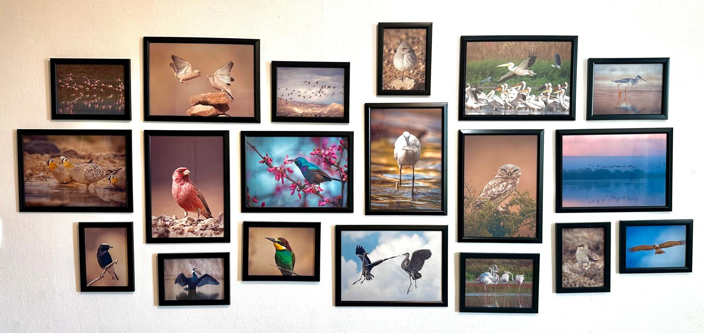

  
# Wall Art  🖼️📸🎨

### App helping to design photo galleries

## Steps:

 - Buy frames (I used 10x A4, 5x 15x20, 5x 13x18 and double sided tape from Temu)
 - Use resize_images.py to resize images if you have high-res photos
 - Run main.py
 - Sizes are hardcoded into the code and can be changed/added
 - Press on "Load Images" and select the folder contating your photos
 - Drag to move the images, right click to toggle between sizes, scroll-wheel click to delete the image
 - Progress can be saved and loaded using the buttons
 - Use merge_images.py to print 15x20
 - Say thanks to ChatGPT and Copilot

## App view:
 

## Final result:
 

